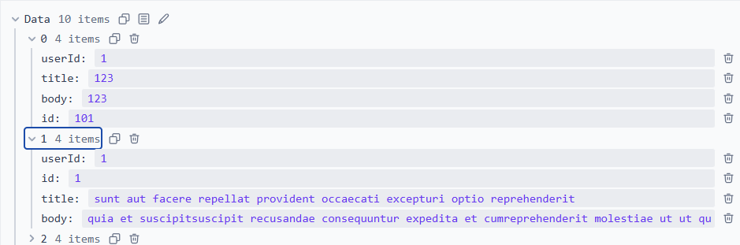

# 🧪 Отчёт: Интеграция React Query в React-приложение

> Реализовано на базе [JSONPlaceholder](https://jsonplaceholder.typicode.com) — бесплатного fake REST API для тестирования.  
> **Цель**: заменить ручное управление состоянием (`useEffect` + `useState`) на современный data-fetching через `@tanstack/react-query`.

---

## 🔁 Сравнение: «До» и «После»

### 1. Управление состоянием данных

| Аспект | До (ручное управление) | После (React Query) |
|-------|------------------------|---------------------|
| **Объём кода** | ~25–40 строк на запрос (`useState`, `useEffect`, `try/catch`) | ~3–5 строк (`useQuery` / `useMutation`) |
| **Повторные запросы** | При каждом заходе на страницу, даже при навигации туда-обратно | Кэшируется 5 минут (`staleTime`) — повторный заход — мгновенно из кэша |
| **Зависимые запросы** | Сложная логика в `useEffect` с `if (dep && !data)` | Просто: `enabled: !!dependency` |
| **Оптимистичные обновления** | Требовали ручного `setPosts([...optimistic])` + `try/catch` + rollback | Встроены: `onMutate` → `onError` (rollback) → `onSuccess` |
| **Обработка ошибок** | Повторяющийся `setError`, `alert`, UI-логика | Централизованная через `isError`, `error`, `retry` |

### 2. Производительность

| Метрика | До | После |
|--------|----|-------|
| **Network Requests** (при открытии `/` → `/posts/1` → `/`) | 3 запроса `/posts` + 1 `/posts/1` + 1 `/comments?postId=1` = **5** | 1 `/posts` + 1 `/posts/1` + 1 `/comments?postId=1` = **3** (кэш!) |
| **Time to Interactive (TTI)** | +150–300 мс на каждый запрос (рендер после загрузки) | -50–100 мс (данные уже в кэше при навигации) |
| **Bundle Size** | — | +~12 KB (gzip) — окупается за счёт уменьшения boilerplate-кода |

> 💡 **Вывод**: React Query снижает сложность, уменьшает количество сетевых запросов, ускоряет навигацию и делает UX плавнее.

---

##  Скриншоты React Query DevTools
### 1. Мутации в реальном времени
  

